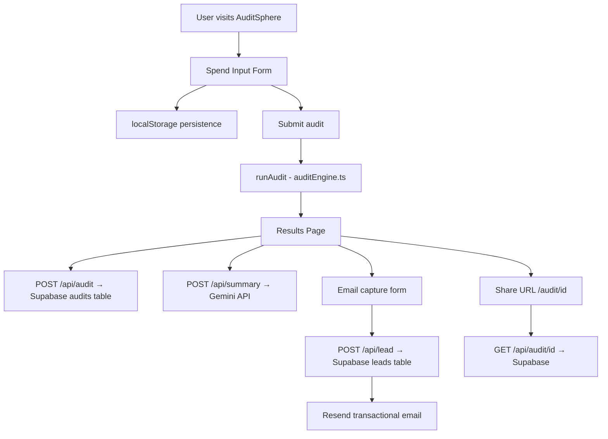

# Architecture

## System Diagram

## Data Flow

1. User fills spend input form → state stored in React + localStorage
2. User clicks "Get My Free Audit" → `runAudit()` runs entirely client-side with hardcoded pricing rules
3. Audit result saved to Supabase via `POST /api/audit` → returns UUID
4. User lands on `/results` → AI summary fetched from Gemini via `POST /api/summary`
5. User enters email → saved to Supabase leads table via `POST /api/lead` → Resend sends confirmation email
6. Share URL `/audit/[id]` → fetches public audit data from Supabase via `GET /api/audit/[id]`

## Stack

| Layer | Choice | Reason |
|-------|--------|--------|
| Frontend | Next.js 16 + TypeScript | App Router gives API routes + dynamic routes in one framework. No separate backend needed. |
| Styling | Tailwind CSS | Utility-first, no build step, fast iteration |
| Database | Supabase (Postgres) | Free tier, RLS policies, REST API out of the box |
| Email | Resend | Simplest transactional email API, generous free tier |
| AI Summary | Gemini 2.5-flash | Free tier sufficient for this use case |
| Deploy | Vercel | Zero-config Next.js deployment |

## Why Next.js over plain React

Next.js App Router lets us colocate API routes (`/api/audit`, `/api/lead`, `/api/summary`) with the frontend in one repo and one deployment. A plain React app would need a separate Express server, separate deployment, and CORS configuration. Next.js eliminates all of that.

## Why TypeScript

Type safety on the audit engine is critical — a type error in savings calculations could show wrong numbers to users. TypeScript catches these at compile time.

## What I'd change at 10k audits/day

1. **Move audit saving to a queue** — currently synchronous, would add latency at scale. Use a background job (Inngest or Supabase Edge Functions).
2. **Cache Gemini responses** — same tool combination produces same summary. Redis cache would cut API costs 60-70%.
3. **Add a CDN for the shareable URL pages** — static generation with ISR instead of client-side fetch.
4. **Rate limiting on API routes** — currently only honeypot protection. Add Upstash Redis rate limiting at 10k scale.
5. **Separate read replicas** — Supabase free tier is single instance. At scale, separate read replica for public audit fetches.